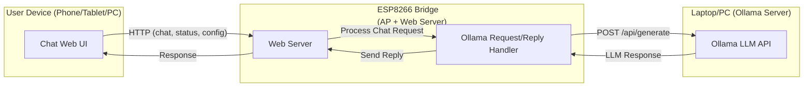

# Offline LLM Bridge  
**ESP8266 + Ollama Private AI Chat**  
*(Offline LLM integration with ESP8266 wireless access point)*

---

## Table of Contents
- [Overview](#overview)
- [System Architecture](#system-architecture)
- [Features](#features)
- [Hardware & Software Requirements](#hardware--software-requirements)
- [Installation & Setup](#installation--setup)
- [Operational Guide](#operational-guide)
- [How It Works](#how-it-works)
- [Troubleshooting](#troubleshooting)
- [Credits](#credits)
- [License](#license)

---

## Overview

**Offline LLM Bridge** enables private, offline conversations with large language models (LLMs) such as Llama 3, running locally on your laptop with [Ollama](https://ollama.com/), using an ESP8266 microcontroller as a WiFi bridge and web server for client devices.

- No internet required
- Mobile-friendly web UI (accessed from phone, tablet, or PC)
- All data stays on your local network

---

## System Architecture

The architecture consists of three main components:

1. **ESP8266 Microcontroller:**  
   - Creates a WiFi Access Point (*LLM-Bridge*)
   - Hosts a web server with a chat UI
   - Forwards user messages to the laptop running Ollama, and returns responses to the client

2. **Laptop/PC running Ollama:**  
   - Runs the LLM model (e.g., Llama 3) via the [Ollama API](https://ollama.com/docs/)

3. **User Device (Phone, Tablet, PC):**  
   - Connects to **LLM-Bridge** WiFi and interacts via a browser

### Architecture Diagram



---

## Features

- **Offline, Private Local AI Chat:** No cloud, no internet needed.
- **Plug-and-play WiFi Bridge:** ESP8266 creates a WiFi AP: `LLM-Bridge` (`llm12345`)
- **Web UI:** User-friendly chat interface compatible with phones and PCs.
- **Configurable:** Change Ollama IP/model via web UI.
- **Hardware-agnostic:** Works with most ESP8266 boards (NodeMCU, Wemos D1 Mini, etc.)

---

## Hardware & Software Requirements

### Hardware
- **ESP8266 microcontroller** (e.g., NodeMCU, Wemos D1 Mini, etc.)
- **Laptop/PC** with [Ollama](https://ollama.com/) installed

### Software & Libraries
- **Arduino IDE** (for flashing ESP8266)
- **ArduinoJson** (v6+)
- **ESP8266WiFi**
- **ESP8266WebServer**
- **ESP8266HTTPClient**
- (Libraries can be installed via Arduino Library Manager)

---

## Installation & Setup

### 1. Prepare [Ollama](https://ollama.com/) on Your Laptop
- **Install Ollama** following their docs
- Start Ollama to accept LAN connections **(important: not just localhost!)**:

#### Windows (PowerShell)
```powershell
$env:OLLAMA_HOST="0.0.0.0"; ollama serve
```
#### Linux/Mac
```bash
OLLAMA_HOST=0.0.0.0 ollama serve
```
- By default, Ollama listens on port `11434`.
- Ensure any firewall allows incoming connections on this port.

### 2. Flash the ESP8266

- Open **llm.ino** in Arduino IDE
- Select your board *(e.g., NodeMCU 1.0)* and COM port (`Tools > Board`)
- Install required libraries if prompted
- Connect via USB data cable, then **Upload**

### 3. Connect Devices to WiFi

- After flashing, the ESP8266 creates a WiFi network:
  - **SSID:** `LLM-Bridge`
  - **Password:** `llm12345`
- **Connect your Laptop** to `LLM-Bridge` (see next section for steps)

---

## Operational Guide

**Step-by-step Quick Start:**

1. **Power on the ESP8266** (it creates the AP)
2. **Connect your laptop** to WiFi SSID:  
   - **LLM-Bridge**  
   - Password: `llm12345`
3. **Start Ollama** (see above for command)
4. **Connect your smartphone or other user device** to the same WiFi (**LLM-Bridge**)
5. **On your phone/browser:**  
   - Go to [http://192.168.4.1](http://192.168.4.1)
6. **Chat!** Type your question on the web page, hit "Send", and see responses.
7. **No response?**  
   - Tap "Config" in the chat UI and ensure "Laptop IP" is set to `192.168.4.2`.

### Operational Workflow

```mermaid
graph TD
  A[Power On ESP8266] --> B{ESP8266 Creates<br>LLM-Bridge WiFi}
  B --> C[Laptop Connects to LLM-Bridge<br>WiFi with Password: llm12345]
  C --> D[Start Ollama Server on Laptop<br>(bind: 0.0.0.0)]
  D --> E[Smartphone/User Device Connects<br>to LLM-Bridge WiFi]
  E --> F[Open Browser:<br>http://192.168.4.1]
  F --> G{Is AI Responding?}
  G -- Yes --> H[Chat with Offline AI!]
  G -- No --> I[Open Config in Chat UI<br>Set Laptop IP to 192.168.4.2]
  I --> G
```

---

## How It Works

### Request/Response Flow

1. **User** types a message in the browser UI.
2. **ESP8266** receives the message at `/chat`, forwards it as a POST to Ollama API on the laptop.
3. **Laptop’s Ollama** generates a response and returns it.
4. **ESP8266** sends this reply back to the browser for display.

### API Endpoints Served by ESP8266

| Endpoint     | Method | Purpose                                   |
|--------------|--------|-------------------------------------------|
| `/`          | GET    | Serves the chat web page (UI)             |
| `/chat`      | POST   | Receives a user message, returns LLM reply|
| `/status`    | GET    | Returns model and internal status info     |
| `/config`    | POST   | Allows changing Laptop IP/model via UI     |

### Main Code Structure

- **setup()**: WiFi AP & server init, endpoints setup.
- **loop()**: Handles HTTP requests.
- **askOllama()**: Sends chat prompt to Ollama’s REST API and retrieves answer.

---

## Troubleshooting

| Problem                | Cause                           | Solution                                            |
|------------------------|---------------------------------|-----------------------------------------------------|
| Cannot reach Ollama    | Firewall or IP not bound        | Start Ollama with `0.0.0.0`, allow firewall         |
| Extended char error    | Unicode/emoji in code           | Use only ASCII/HTML entities for icons/text         |
| Exit Status 2/74       | Bad board/USB/data cable        | Confirm ESP8266 board in Arduino IDE; use data USB  |

> **Tip:**  
> If responses are still not received:  
> - Use the "Config" button in the web UI to correct the laptop IP, usually `192.168.4.2`.
> - Check Ollama is running without errors and laptop is on the correct WiFi.

---

## Credits

- [Ollama](https://ollama.com/)
- [ESP8266 Arduino Core](https://github.com/esp8266/Arduino)
- Llama 3, TinyLlama and other open-source LLMs

---

## License

*Specify your license here (e.g., MIT, GPL, CC-BY).*

---

## Contacts & Feedback

For questions or contributions, please open an issue or contact the maintainer.
